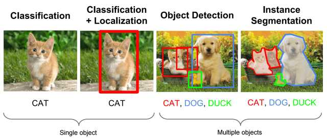

# Localization, Detection, Segmentation의 개념

> 공부해가는 과정이라 오류나 오타 등이 있을 수 있습니다. 이는 계속적으로 수정하고 보완하겠습니다.

기존 CNN을 이용해 Classification을 수행해왔다.

이제는 Localization, Object Detection, Segmentation에 대해서 공부할 것이다.  

  

## Localization, Detection, Segmentation

https://theaisummer.com/Localization_and_Object_Detection/

이미지에서 특정 객체(object)를 찾아 상자 모양을 치는데 이를 Bounding Box라고 한다.

-   Localization
    -   이미지 내에서 1개의 Object의 위치를 Bounding Box로 지정해 찾는 것
-   Object Detection
    -   이미지 내에서 여러 Object들에 대한 위치를 Bounding Box로 지정해 찾는 것
-   Segmentation
    -   Bounding Box를 넘어 Pixel 단위로 Detection을 수행하는 것

Localization과 Detection은 Bounding Box를 찾는 regression 과정과 object의 분류하는 Classification 두개가 합쳐진 과정이다.  
상대적으로 Detection은 이미지내에서 여러 물체를 찾으므로 Localization에 비해 복잡하고 어려운 과정이다.  

  

## One-stage, Two-stage detection

-   One-stage detection
    
    -   이미지 내에서 바로 object를 detection 하는 것
    -   속도가 상대적으로 Two-stage detecion에 비해 빠르다.
    -   대표적으로 YOLO, SSD, Retina-Net 등
-   Two-stage detection
    
    -   이미지 내에서 대략적인 object의 위치를 잡고(1 stage) detection 과정 진행(2 stage)
    -   아무래도 2단계로 진행되니 속도 issue가 있어서 실시간 적용이 힘들 수 있다.
    -   대표적으로 RCNN, SPPNET, Fast RCNN, Faster RCNN 등

  

## Object Detection이 어려운 이유?

1.  Bounding Box를 찾아 분류하는 과정이 복잡하다.
    -   Regression과 Classification 과정을 같이 진행해야 하고 Loss함수도 복잡해진다.
2.  이미지 내에 Object가 많다.
    -   여러 Object들이 있으니 detection과 classification이 복잡하다. 또한 작은 object들은 찾기 어렵다.
3.  속도 issue
    -   실시간성을 요구하는 경우, 정확성이 중요한 경우... 속도와 성능은 보통 trade-off 관계
4.  모호한 이미지
    -   object가 명확하지가 않다. 뭘 찾는지 모르는 경우가 생길 수 있다.
5.  데이터셋의 부족
    -   bounding box가 label로 있는 이미지 데이터셋이 아무래도 부족하다. (훈련의 어려움...)